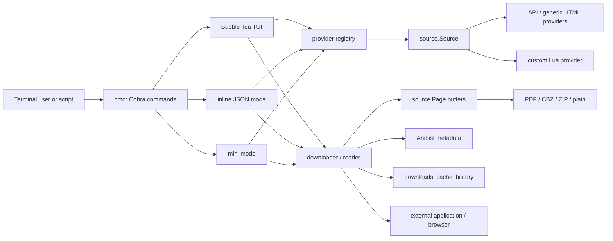

# Architecture

## System purpose

Static Mangal is a cross-platform terminal application for discovering manga from providers, selecting chapters, downloading their page images, exporting them as PDF/CBZ/ZIP/plain files, opening them in an external reader, and storing reading history. It also exposes a JSON-oriented inline mode and optional AniList metadata/progress integration.

The process starts in `main.go`: configuration is initialized, logging is configured, then Cobra executes the selected command. There is no server process or persistent application database. State is stored in configuration/cache/history files and in downloaded content directories.



## Runtime layers

### Command and presentation layer

- **`cmd/`** defines Cobra commands, global flags, configuration management, source management, integration setup, and error presentation. `cmd/root.go` starts the TUI when no subcommand is supplied.
- **`tui/`** contains the default Bubble Tea application. `statefulBubble` holds UI components, selected providers/sources/chapters, channels, state history, and download outcomes. `handlers.go` performs source loading, search, chapter retrieval, download/read work, and AniList lookup asynchronously.
- **`mini/`** provides a smaller interactive flow modeled after `ani-cli`.
- **`inline/`** is the automation-facing flow. It can list JSON, select a manga/chapter by a compact selector language, download selected chapters, or invoke the reader.
- **`open/`** starts external configured readers or browsers; **`style/`**, **`color/`**, **`icon/`**, and **`key/`** support terminal output and configuration identifiers.

The presentation layer directly invokes provider and downloader packages. There is no application-service boundary, which keeps the code compact but couples command/UI behavior to global configuration and concrete infrastructure.

### Source and provider layer

The central provider contract is `source.Source` (`source/source.go`):

```go
type Source interface {
    Name() string
    Search(query string) ([]*Manga, error)
    ChaptersOf(manga *Manga) ([]*Chapter, error)
    PagesOf(chapter *Chapter) ([]*Page, error)
    ID() string
}
```

Domain objects in `source/` are mutable and link in both directions: a manga owns chapters, a chapter owns pages and refers to its manga, and pages refer to their chapter. A `Manga` also contains provider-specific identity, AniList association, metadata, and cache flags.

`provider/` converts a `Provider` factory into a `source.Source` instance. Built-in providers are:

- **MangaDex** — a purpose-built API adapter in `provider/mangadex/`.
- **Manganelo**, **Manganato**, and **MangaPill** — declarative selector configurations executed by `provider/generic/` using Colly and GoQuery.
- **Custom Lua providers** — `.lua` files stored below the configured sources directory and loaded by `provider/custom/` using GopherLua plus `mangal-lua-libs`.

`provider/generic/` owns Colly collectors and in-memory result maps keyed by request URL. Its callbacks populate source model objects as a side effect; callers receive slices from those maps after `Collector.Wait()`.

### Download, metadata, and export layer

The normal download path is `downloader.Download`:

1. Compute the chapter destination and decide whether to reuse or replace it.
2. Ask the selected source for pages. Providers populate `chapter.Pages`.
3. Download every page into a `bytes.Buffer` held by each `source.Page`.
4. Optionally fetch and attach AniList metadata.
5. Optionally write `series.json` and a cover image.
6. Convert buffered pages into the configured format.
7. Optionally persist reading history.

`source.Page.Download` uses the shared `network.Client`, adds `Referer` and user-agent headers, then reads the entire page into memory. Converter implementations consume these buffers:

| Package | Output | Metadata behavior |
| --- | --- | --- |
| `converter/pdf` | One PDF | Embeds page images; unsupported images may be skipped. |
| `converter/cbz` | ZIP-based CBZ | Adds pages and optionally `ComicInfo.xml`. |
| `converter/zip` | ZIP | Adds pages. |
| `converter/plain` | Directory | Writes page files directly. |

`downloader.Read` uses an existing download or a temporary conversion, then invokes the configured reader through `open/` and saves history when enabled.

### External integrations and query support

- **`anilist/`** issues GraphQL searches, caches search results and explicit name-to-ID bindings, and chooses a closest title with Levenshtein distance.
- **`integration/anilist/`** runs the AniList OAuth PIN flow and sends `SaveMediaListEntry` mutations when history is saved.
- **`query/`** stores query suggestions.
- **`installer/`** lists a configurable GitHub repository tree, downloads custom scraper content from GitHub API URLs, and writes Lua files to the source directory.
- **`update/`** rereads downloaded chapter formats into an in-memory filesystem and regenerates `series.json`, cover art, and ComicInfo metadata.

## State and filesystem model

`where/` derives all paths and creates directories as a side effect:

| State | Default location | Owner |
| --- | --- | --- |
| Configuration | OS config directory / `static-mangal` | Viper, `config/`; plaintext TOML credentials are user-only (`0700` directory/`0600` file) on Unix and rely on account ACLs on Windows |
| Custom sources | `<config>/sources` | `provider/custom`, `installer` |
| AniList bindings | `<config>/anilist.json` | `anilist/` |
| History | `<config>/history.json` | `history/` |
| Logs | `<config>/logs` | `log/` |
| Query cache | OS cache directory / `mangal/queries.json` | `query/` |
| Generic scraper cache | OS cache directory / `mangal` | Colly generic providers |
| Downloads | `downloader.path`, default current directory | `source`, `converter` |
| Temporary read conversion | OS temp directory / `mangal` | `downloader`, `source` |

`filesystem/` wraps Afero and exposes a mutable process-global filesystem. Production defaults to the OS filesystem; tests and `update/` switch it to an in-memory filesystem. Viper is likewise process-global. These choices simplify the original CLI but make parallel tests, dependency isolation, and reusable library APIs difficult.

## Configuration model

`config.Setup` configures Viper to read `static-mangal.toml`, bind non-sensitive keys to environment variables with `MANGAL_` prefix and dot-to-underscore mapping, install defaults, and resolve `~`/environment variables in `downloader.path` after reading config. Sensitive credential environment values are intentionally not registered with Viper; AniList runtime access uses the centralized `config.SensitiveValue` accessor, falling back to persisted config without serializing environment-only credentials. The centralized config write helper preserves Viper's TOML serialization while enforcing the configuration directory and file permissions after creation and every write; it also hardens legacy files when they are read. It does not change cache, history, log, source, download, or temporary paths.

`MANGAL_CONFIG_PATH` may select a custom config directory, but an existing custom directory must already be a dedicated owner-only directory; unsafe custom paths are rejected rather than chmodded. Missing custom directories are created privately. The default application directory retains migration/hardening behavior.

There are 53 defaulted keys (`key.DefinedFieldsCount`). They group into:

- downloader path, chapter template, source selection, concurrency, redownload, directory layout, cover, and stop-on-error behavior;
- output format and unsupported-image handling;
- AniList metadata and generated `ComicInfo.xml`/`series.json` controls;
- external reader/browser commands;
- reading/download history;
- provider-specific MangaDex settings;
- custom-scraper repository coordinates and generator author;
- logs; AniList OAuth credentials and behavior; and TUI/CLI presentation.

`mangal config info` remains the canonical runtime reference because it emits every key, type, current/default value, description, and corresponding environment variable; sensitive current values are always masked.

## Trust boundaries

1. **Provider responses and page images** are untrusted remote input. The CLI parses HTML/JSON and buffers images entirely in memory before conversion.
2. **Custom Lua scrapers** are executable code fetched from a remote repository selected by mutable configuration values. They run in-process with preloaded library modules.
3. **AniList credentials** are read from normal configuration fields. The access token is memory-only, but client ID, secret, and OAuth PIN may be persisted in plaintext TOML. Unix limits the configuration directory to the owner and the file to owner read/write; Windows depends on account ACLs. No keychain is used.
4. **Downloaded archives** are parsed by metadata-update code. `util.Unzip` is intended to reject Zip Slip paths but checks the uncleaned joined path; it should normalize before verifying containment.
5. **External readers and browsers** are user-configured commands and therefore a deliberate local execution boundary.

## Architectural constraints to preserve

- Preserve a deterministic, script-friendly JSON interface; generate schemas from real types and version the output contract before changing it.
- Keep provider failures isolated: one failed source must not corrupt a search result, block the TUI, or leave partial state masquerading as a successful download.
- Treat downloaded artifacts as transactional: a completed file/directory is visible only after pages and metadata are written successfully.
- Never make provider/plugin code a hidden trusted dependency. Pin and verify what is installed, expose provenance, and make unsafe execution an explicit opt-in.
