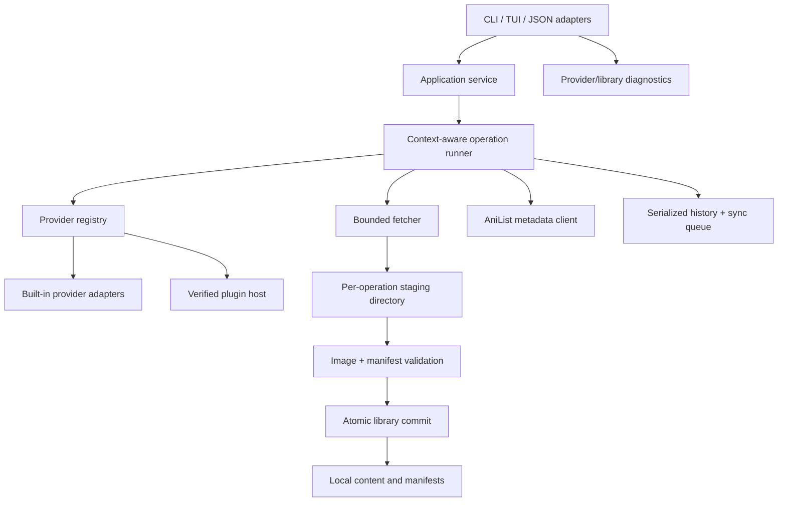

# Technical strategy

## Recommended technical direction

Build a **reliable local manga library and automation CLI**, not a larger collection of brittle site-specific features. The differentiator should be trustworthy offline artifacts, stable scripting, transparent source provenance, and fast recovery when a provider changes.

The current product already has the raw ingredients: a terminal-first interface, source abstraction, inline JSON mode, exports, metadata, history, and custom scrapers. The strategy should turn those ingredients into explicit, versioned contracts instead of adding more mutable global state and in-process scraping logic.

## Product principles translated into technical decisions

| Product need | Technical decision |
| --- | --- |
| Downloads must be trusted and resumable | Stage each operation in an isolated directory; validate every page; atomically commit completed chapter artifacts and a manifest. |
| Automation must survive releases | Treat `inline --json` as a versioned API. Publish schemas, golden fixtures, compatibility policy, semantic exit codes, and stable stderr/error JSON where requested. |
| Sources will fail independently | Use provider capability metadata, typed errors, health checks, fixtures, per-provider circuit breaking, and a source-status command. Never make one source failure poison an entire search. |
| Plugins are a supply-chain boundary | Install from signed, versioned manifests pinned to immutable artifacts. Record provenance. Isolate third-party execution when practical. |
| Reader libraries outlive source layouts | Maintain a local manifest for every completed chapter: provider ID, source URL/ID, manga/chapter identity, checksums, pages, format, downloaded time, and metadata revision. |
| Maintenance must be sustainable | Keep a small core, declarative source adapters, fixtures, deterministic tests, pinned toolchains, and a clear end-of-life policy for unsupported providers. |

## Target architecture



### 1. Core application service

Create a small package that owns a request-scoped operation and accepts explicit dependencies:

- context;
- provider registry;
- HTTP client/fetch policy;
- filesystem/library root;
- metadata client;
- history sink;
- logger/progress reporter; and
- configuration snapshot.

The service exposes operations such as `Search`, `ListChapters`, `Download`, `Read`, `UpdateMetadata`, and `InstallProvider`. Cobra, Bubble Tea, mini mode, and inline mode become adapters that translate input and render typed results. They do not mutate downloader/provider state directly.

This is a targeted separation, not a framework rewrite. Keep the existing `source.Source` shape initially, then add context to a new interface once all built-ins and plugin host can support it.

### 2. Transactional chapter operations

For each download/read conversion:

1. Create a unique staging directory under the target library filesystem.
2. Fetch pages using a bounded worker pool and context cancellation.
3. Validate response status, image type/decode, byte limits, filename, checksum, and ordering.
4. Build output and metadata inside staging.
5. Write a manifest and verify expected pages/artifacts.
6. Atomically rename the chapter directory/file into its final destination.
7. Persist history and enqueue optional remote sync after commit.

This removes global temp collisions, avoids presenting partial downloads as complete, makes retry/resume possible, and gives diagnostics a durable source of truth.

### 3. Provider model

Retain two tiers:

- **Built-ins:** first-party Go adapters for stable, supported providers. They receive fixtures, contract tests, response-size limits, and explicit support ownership.
- **Plugins:** separate, verified provider artifacts with a versioned manifest. The host should expose a narrow request/response API instead of sharing unrestricted process state. Start with a strict Lua capability policy and an explicit enable prompt; evolve toward a subprocess host if the library functions cannot be safely limited.

Provider metadata should contain: ID, display name, type, version, provenance, immutable source reference, supported capabilities, content-language/region constraints, health status, last check, and deprecation notice. This makes source behavior inspectable from both TUI and inline mode.

### 4. Library and metadata model

The current filesystem output should remain compatible initially, but every new completed chapter should include or be accompanied by a machine-readable manifest. A minimal manifest has:

```json
{
  "schemaVersion": 1,
  "manga": {"title": "…", "providerId": "…", "providerMangaId": "…", "sourceUrl": "…"},
  "chapter": {"title": "…", "number": "…", "providerChapterId": "…", "sourceUrl": "…"},
  "downloadedAt": "RFC 3339 timestamp",
  "artifacts": [{"path": "…", "sha256": "…", "format": "cbz"}],
  "pages": [{"index": 1, "sha256": "…", "bytes": 0}],
  "metadataRevision": "…"
}
```

Choose a stable library root/path template and document migration behavior before adding a catalog database. A filesystem-plus-manifest model is sufficient for the next phase; add SQLite only when cross-library search, deduplication, sync, or a rich catalog genuinely requires indexed queries.

### 5. Scriptable API

Inline JSON is the clearest expansion surface. Stabilize it before exposing an HTTP server or GUI:

- include an explicit output `schemaVersion`;
- emit deterministic ordering;
- guarantee one JSON document per invocation or document JSON Lines semantics;
- route logs to stderr and payloads to stdout;
- define error codes and machine-readable error envelopes;
- publish generated JSON Schema with every release; and
- test backward compatibility against checked-in golden fixtures.

Only consider a local API/daemon after the CLI contract and library manifests support a real consumer. A daemon prematurely introduces authentication, lifecycle, and migration complexity without solving the current reliability defects.

## Roadmap

### Milestone 0 — establish fork ownership and a reproducible baseline

**Goal:** Make the repository safely releasable under its own identity.

- Choose product/repository/module name and canonical support, package, container, scraper, and installer URLs.
- Rehome imports, build metadata, GoReleaser, README/scripts/help text, and CI release targets.
- Select a supported Go release; update/pin actions and GoReleaser; define vendor policy.
- Replace release-time `go mod tidy` with verification that dependencies are already tidy.
- Add a documented supported-platform matrix and a no-release gate until tests, race tests, and a release dry run pass.

**Exit evidence:** a dry-run release produces artifacts branded exclusively for this fork; CI runs deterministic tests on supported platforms; no first-party runtime/release path points to an upstream-owned destination.

### Milestone 1 — repair safety-critical local behavior

**Goal:** Ensure a single chapter operation is race-free, bounded, and transactional.

- Fix the confirmed volume-path, nil-page, cover-status, temporary-directory, response-body, and mutable-concurrency defects in the review.
- Add a context-aware bounded page fetcher with per-page and chapter limits.
- Stage then atomically commit output; clean incomplete staging on cancel/failure.
- Replace TUI shared channels/state mutations with typed Bubble Tea messages.
- Add deterministic unit tests and `-race` coverage for success, failure, cancellation, retry, path layout, and two-provider searches.

**Exit evidence:** focused race-enabled tests cover every corrected concurrency path; interrupted downloads leave no final artifact; format and history behavior remain backward compatible or have a documented migration.

### Milestone 2 — secure and operationalize providers

**Goal:** Make source availability and trust visible and maintainable.

- Implement pinned/signed plugin manifests with provenance records and disable-by-default unsafe capabilities.
- Add provider fixtures, contract tests, and opt-in live smoke tests.
- Introduce provider health/status diagnostics and clear source-specific errors.
- Keep a deliberately small supported built-in set; deprecate dead/unmaintained adapters rather than accumulating them.
- Establish a response-change triage workflow: fixture capture, parser update, contract regression test, and release note.

**Exit evidence:** installed plugins have verifiable provenance; a source can fail without blocking other sources; provider tests are deterministic by default and live checks report availability separately.

### Milestone 3 — make the local library the durable product asset

**Goal:** Let users manage downloaded content independently of provider volatility.

- Write per-chapter manifests and checksums.
- Add `library verify`, `library list`, `library repair`, and `library migrate` commands through the inline-compatible core.
- Preserve/upgrade `ComicInfo.xml` and `series.json` as exports, not the only source of identity.
- Add resumable staging and duplicate detection based on provider IDs/checksums.
- Serialize history and model AniList sync as a retryable queue with visible status.

**Exit evidence:** users can validate, locate, and repair their local library without re-querying a provider; pending AniList synchronization is observable and recoverable.

### Milestone 4 — improve experience only after core contracts hold

**Goal:** Make the interface faster and clearer without duplicating business logic.

- TUI displays source health/provenance, operation progress/cancellation, completed versus partial downloads, and retry actions.
- Inline mode provides stable structured errors and source/library diagnostics.
- Add accessibility-friendly no-color/non-TUI paths and clear reader configuration validation.
- Evaluate richer catalog/search features against real library-manifest needs; introduce SQLite only with a migration and backup plan.

**Exit evidence:** interactive and scriptable interfaces call the same service contracts; no UI-only workaround exists for core errors.

## Decisions to make before implementation

These are product ownership decisions; resolve them once, record them in the repository, then make a clean cutover.

1. **Identity:** Keep the `mangal` executable name or adopt a new name? This determines module path, config path, output defaults, migration, package channels, and user expectations.
2. **Support policy:** Which built-in providers are actively supported, and what regions/content rules apply? A curated small list is technically sustainable; an open-ended list is not without plugin governance.
3. **Plugin trust:** Are third-party scrapers allowed at all? If yes, who signs manifests and what permissions are acceptable? Do not ship a silent remote-execution installer.
4. **Library compatibility:** Preserve the current directory/file layout exactly, or offer an opt-in library root/manifest migration? A compatibility layer is preferable until real users can migrate safely.
5. **Automation promise:** Is inline JSON a stable public API? If yes, commit to versioning and compatibility tests before changing it.
6. **Remote sync:** Is AniList progress synchronization a core supported feature? If yes, treat OAuth secret storage, retries, rate limits, and user-visible failure state as first-class requirements.

## Explicit non-recommendations

- Do not add more scraper targets before the provider trust/reliability baseline.
- Do not build a web service, account system, or database-first rewrite before the local operation and inline contracts are stable.
- Do not silently retain upstream release/install channels for convenience.
- Do not promise provider permanence; source sites change. Promise transparent status, isolated failures, deterministic local artifacts, and a clear maintenance policy instead.
